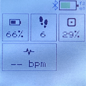
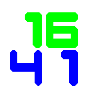

# Monty Clock

## Usage and Features

App consists of 3 screens:

- default is Clock screen
  - on touch it displays current date for 4 seconds
- left screen has widgets with informations
  - battery percentage
  - HMR
  - Ram usage percentage
  - Steps
- right screen is for Music control (iOS only)
  - Displays current playing song - title, album, artist

## Controls

3 screens:

- default is Clock screen
  - touch to show date
  - swipe left/right to change screen
- left screen has widgets with informations
  - swipe right to change screen
- right screen is for Music control (iOS only)
  - swipe left -> previos screen
  - swipe right -> next song
  - swipe down  -> volume down
  - swipe up -> volume up
  - touch -> play/pause

## Requests

Contact Martin Skalický <skalicky.martas@seznam.cz>.

## Creator

Martin Skalický <skalicky.martas@seznam.cz>
